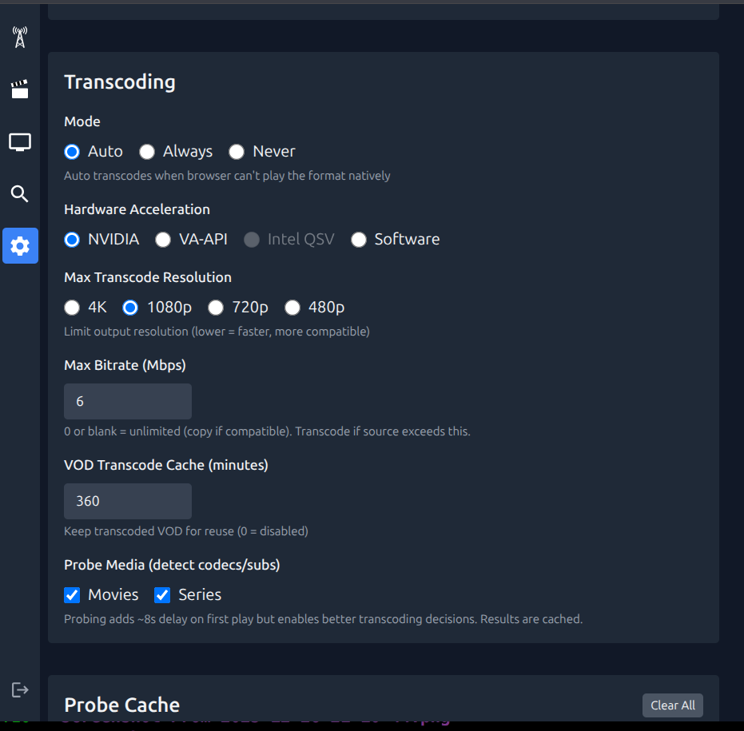
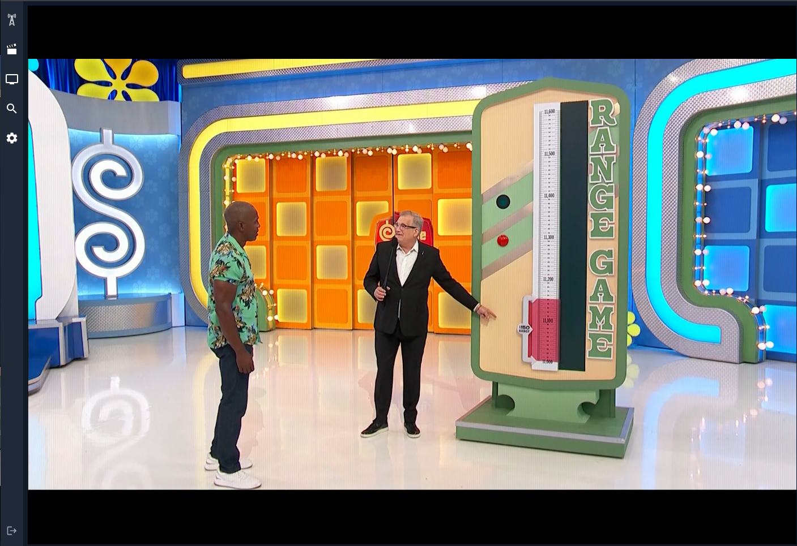
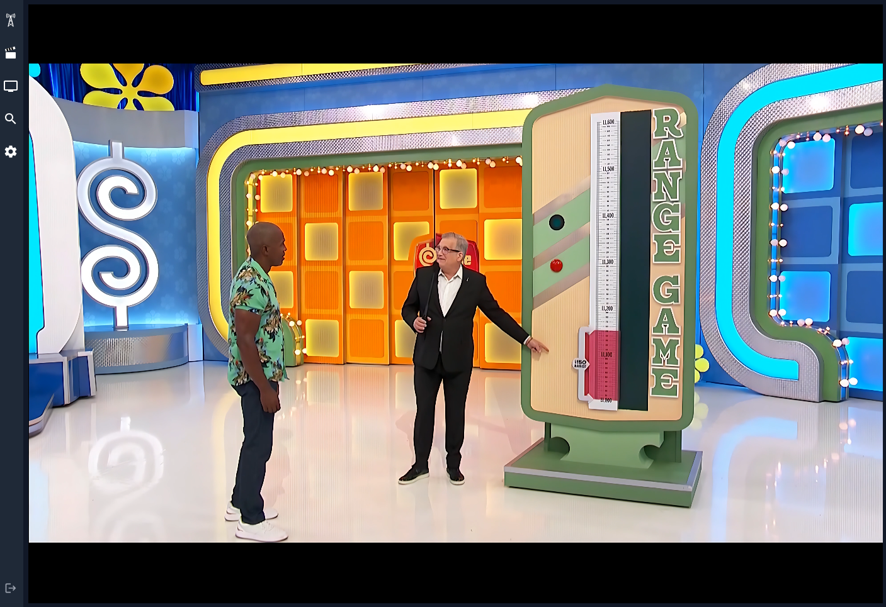
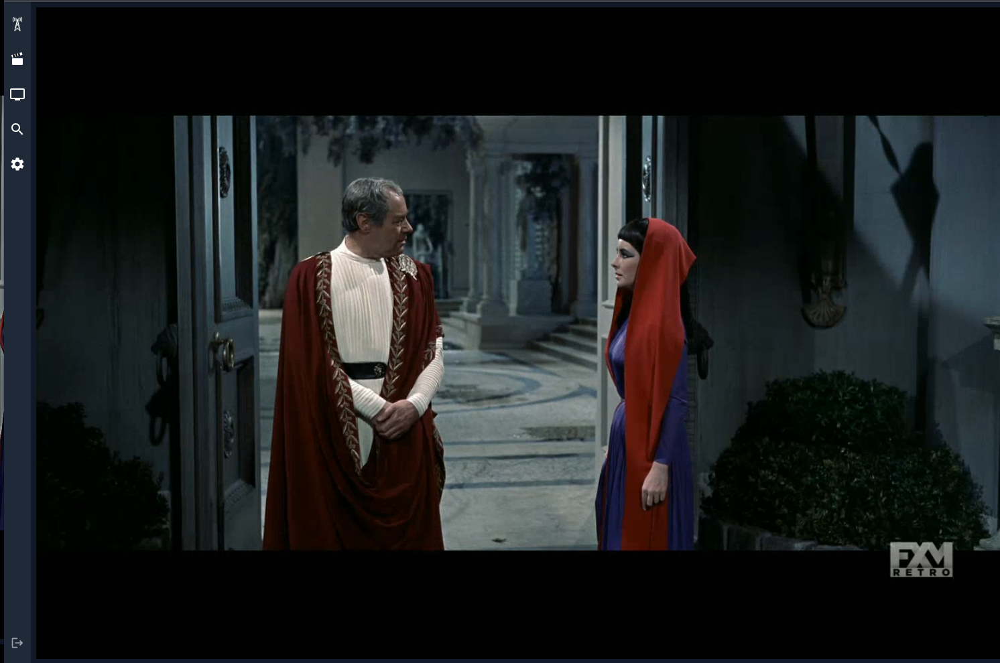
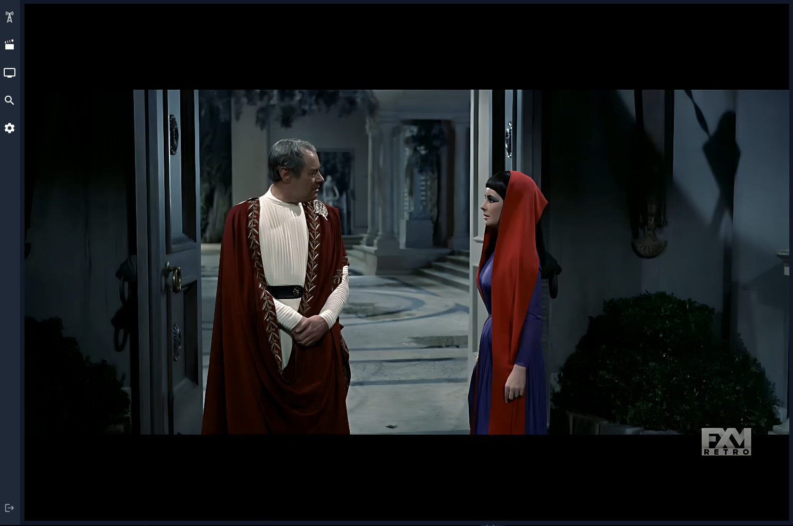
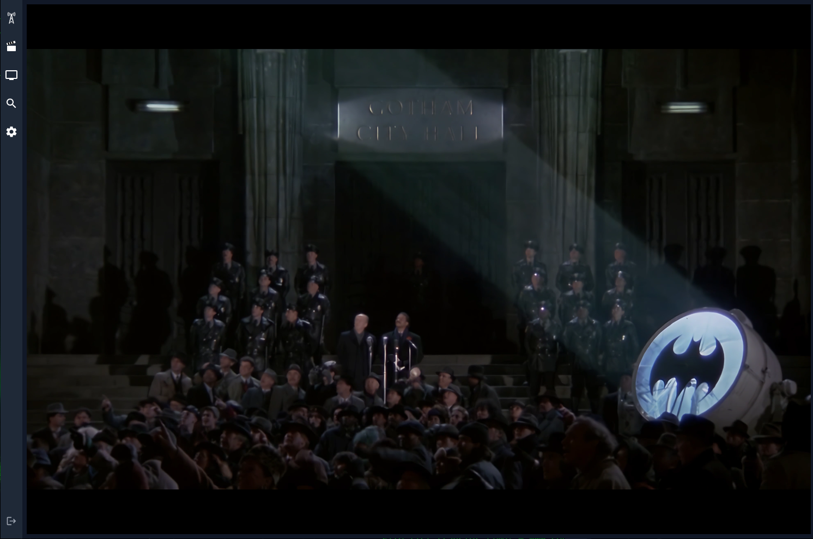

# neTV

A minimal, self-hosted web interface for IPTV streams.




## Why This Exists

We built neTV because we couldn't find a clean, lightweight interface for
Xtream IPTV services. Existing solutions were either bloated media centers or
clunky apps that didn't work well across devices.

**neTV is intentionally minimal.** It does one thing: play your IPTV streams
with a clean UI that works on desktop, tablet, mobile, and Chromecast.

We also prioritize **keyboard navigation** throughout (though still rough
around the edges). The entire app is theoretically usable with just arrow keys,
Enter, and Escape -- perfect for media PCs, HTPCs, or anyone who prefers
keeping hands on the keyboard (like me).

### Disclaimer

This is a **player only** -- it does not provide any content. You must have your
own IPTV subscription that provides Xtream Codes API access or M3U playlists.
Users are responsible for ensuring they have legal rights to access any content
through their IPTV providers.

## Features

- **Live TV** with EPG grid guide
- **Movies & Series** with metadata, seasons, episodes
- **AI Upscale** - Real-time 4x upscaling via TensorRT (720p → 4K @ 85fps)
- **Chromecast** support (HTTPS required)
- **Closed captions** with style customization
- **Search** across all content (supports regex)
- **Favorites** with drag-and-drop ordering
- **Resume playback** for VOD content
- **Responsive** - works on desktop, tablet, mobile
- **Keyboard navigation** - 10-foot UI friendly

### Transcoding

Extensively optimized for minimal latency and CPU usage:

- **Smart passthrough** - h264+aac streams remux without re-encoding (zero CPU)
- **Full GPU pipeline** - NVDEC decode → NVENC/VAAPI encode, CPU stays idle
- **Probe caching** - Streams probed once, series episodes share probe data
- **Interlace detection** - Auto-deinterlaces OTA/cable, skips progressive
- **Smart seeking** - Reuses segments for backward seeks, only transcodes gaps
- **Session recovery** - VOD sessions survive restarts, resume where you left off
- **HTTPS passthrough** - Auto-proxies HTTP streams when behind HTTPS

### 4K AI Upscaling

Real-time 4x upscaling using Real-ESRGAN via TensorRT. Transforms 480p/720p/1080p
content to pristine 4K at 85fps (RTX 5090). Perfect for older shows and low-bitrate streams.

| Before (720p source) | After (4K AI Upscale) |
|---|---|
|  |  |
|  |  |
|  |  |

Requires Nvidia GPU and the [AI Upscale Docker image](#ai-upscale-image-nvidia-gpu).
The Settings page shows AI Upscale options when TensorRT engines are available.

## Alternatives

If you want a full-featured media center, you might be happier with:

- **[Jellyfin](https://jellyfin.org/)** - Free, open-source media system
- **[Emby](https://emby.media/)** - Media server with IPTV support
- **[Plex](https://plex.tv/)** - Popular media platform with live TV

These are excellent, mature projects with large communities. neTV exists for
users who find them overkill and just want a simple IPTV player.

| | neTV | [nodecast-tv] | [Jellyfin] | [Emby] | [Plex] |
|---|---|---|---|---|---|
| **Focus** | IPTV | IPTV | General media | General media | General media |
| **Xtream Codes** | ✅ | ✅ | ❌ | ❌ | ❌ |
| **M3U playlists** | ✅ | ✅ | ✅ | ✅ | ⚠️ Via [xTeVe] |
| **XMLTV EPG** | ✅ | ⚠️ Via provider | ✅ | ✅ | ✅ |
| **Local media** | ❌ | ❌ | ✅ | ✅ | ✅ |
| **Live TV** | ✅ | ✅ | ✅ | ✅ | ✅ |
| **VOD (movies/series)** | ✅ | ✅ | ✅ | ✅ | ✅ |
| **DVR recording** | ❌ | ❌ | ✅ | ✅ | ⚠️ Pass |
| **Catchup/timeshift** | ❌ | ❌ | ⚠️ Plugin | ⚠️ Plugin | ❌ |
| **Live rewind buffer** | ✅ | ❌ | ⚠️ Via DVR | ⚠️ Via DVR | ⚠️ Via DVR |
| **Resume playback** | ✅ | ❌ | ✅ | ✅ | ✅ |
| **Multi-user** | ✅ | ✅ | ✅ | ✅ | ✅ |
| **User roles** | ⚠️ Admin/viewer | ⚠️ Admin/viewer | ✅ Granular | ✅ Granular | ✅ Granular |
| **Stream limits** | ✅ Per-user, per-source | ❌ | ⚠️ Per-user | ⚠️ Per-user | ⚠️ Per-user |
| **Library permissions** | N/A | N/A | ✅ Per-library | ✅ Per-library | ✅ Per-library |
| **Favorites** | ✅ Drag-and-drop | ✅ | ✅ | ✅ | ✅ |
| **Search** | ✅ Regex | ✅ Basic | ✅ Basic | ✅ Basic | ✅ Basic |
| **Video transcoding** | ✅ | ❌ | ✅ | ✅ | ✅ |
| **Audio transcoding** | ✅ | ✅ | ✅ | ✅ | ✅ |
| **Transcode only if needed** | ✅ Auto mode | ❌ | ⚠️ Per-library | ⚠️ Per-library | ⚠️ Per-client |
| **NVENC** | ✅ | ❌ | ✅ | ✅ | ⚠️ Pass |
| **VAAPI** | ✅ | ❌ | ✅ | ✅ | ⚠️ Pass |
| **QSV** | ✅ | ❌ | ✅ | ✅ | ⚠️ Pass |
| **AI Upscale (4x)** | ✅ TensorRT | ❌ | ⚠️ Plugin | ❌ | ❌ |
| **Software fallback** | ✅ | ❌ Browser | ✅ | ✅ | ✅ |
| **Legacy GPU** | ✅ Any | ❌ No (browser) | ✅ Any | ✅ Any | ⚠️ Driver 450+ |
| **ffprobe caching** | ✅ Dynamic | ❌ None | ⚠️ Offline | ⚠️ Offline | ⚠️ Offline |
| **Episode probe reuse** | ✅ MRU | ❌ No | ⚠️ Per-file | ⚠️ Per-file | ⚠️ Per-file |
| **Session recovery** | ✅ Yes | ❌ No | ⚠️ Via DB | ⚠️ Via DB | ⚠️ Via DB |
| **Auto deinterlace** | ✅ Yes | ❌ No | ⚠️ Manual | ⚠️ Manual | ⚠️ Manual |
| **Subtitles** | ⚠️ WebVTT | ❌ No | ✅ Full | ✅ Full | ✅ Full |
| **Chromecast** | ✅ Yes | ❌ No | ✅ Yes | ✅ Yes | ✅ Yes |
| **Keyboard/remote** | ✅ 10-foot UI | ⚠️ Basic | ✅ 10-foot UI | ✅ 10-foot UI | ✅ 10-foot UI |
| **Mobile apps** | ⚠️ Web only | ⚠️ Web only | ✅ Native | ✅ Native | ✅ Native |
| **Subscription** | ✅ Free | ✅ Free | ✅ Free | ⚠️ Premiere | ⚠️ Pass |
| **Setup complexity** | ✅ Minimal | ✅ Minimal | ⚠️ Moderate | ⚠️ Moderate | ⚠️ Moderate |
| **License** | Apache 2.0 | GPL v3 | GPL v2 | GPL v2 | Proprietary |
| **Stack** | Python, FFmpeg | Node.js | .NET, FFmpeg | .NET, FFmpeg | Proprietary |

*Corrections welcome — [open an issue](https://github.com/jvdillon/netv/issues).*

[nodecast-tv]: https://github.com/technomancer702/nodecast-tv
[Jellyfin]: https://jellyfin.org
[Emby]: https://emby.media
[Plex]: https://plex.tv
[xTeVe]: https://github.com/xteve-project/xTeVe

## Installation

### Docker

Create a `docker-compose.yml`:

```yaml
services:
  netv:
    image: ghcr.io/jvdillon/netv:latest
    ports:
      - "8000:8000"
    volumes:
      - ./cache:/app/cache
      - /etc/localtime:/etc/localtime:ro
    devices:
      - /dev/dri:/dev/dri  # for hardware transcoding (remove if no GPU)
    restart: unless-stopped
```

Then run:

```bash
docker compose up -d
```

Open http://localhost:8000. To update: `docker compose pull && docker compose up -d`

#### Optional: Nonfree (proprietary) FFMPEG optimized for Nvidia or AMD and/or Intel GPU

We provide a custom built ffmpeg with Nvidia, AMD, and Intel _proprietary
support_ for GPUs. Notably, essential packages are built from source and often
_significantly_ newer than whats baked into Ubuntu.

The custom built ffmpeg is not required unless you:
- want the best possible GPU performance,
- bleeding edge builds,
- have an AMD GPU,
- want realtime AI upscaling (Nvidia only).

| | Optimized (default) | Ubuntu Stock |
|---|---|---|
| FFmpeg source | Pre-built with all codecs | apt (Ubuntu repos) |
| VAAPI (Intel/AMD) | ✅ | ✅ |
| QSV (Intel QuickSync) | ✅ | ✅ |
| NVENC (LLVM) | ❌ | ✅ |
| NVENC (Nvidia nvcc optimized) | ✅ | ❌ |
| AMD (GPU) AMF | ✅ | ❌ |
| Fraunhofer FDK AAC | ✅ | ❌ |
| TensorRT | ✅ | ❌ |
| AV1 Vulkan | ✅ | ❌ |

For Nvidia, you will need the [nvidia-container-toolkit](https://docs.nvidia.com/datacenter/cloud-native/container-toolkit/latest/install-guide.html).

To determine which ffmpeg build for Cuda, check your driver and compute capability:
```bash
nvidia-smi --query-gpu=driver_version,compute_cap --format=csv,noheader
# Example: 580.87.02, 8.6 → Driver 580, compute ≥7.5 → use cuda13.0
```

Find your CUDA version ([source](https://docs.nvidia.com/cuda/cuda-toolkit-release-notes/index.html)):

| Driver | < 7.5 (Maxwell/Pascal/Volta) | ≥ 7.5 (Turing+) |
|--------|------------------------------|-----------------|
| 550 | cuda12.4 | cuda12.4 |
| 560 | cuda12.6 | cuda12.6 |
| 570 | cuda12.8 | cuda12.8 |
| 580+ | cuda12.8 | cuda13.0 |

Then run:
```bash
FFMPEG_IMAGE=ghcr.io/jvdillon/netv-ffmpeg:<cuda-version> docker compose --profile nvidia up -d
```

For AMD or Intel, it does not matter which version you choose nor do you need Cuda installed.

#### Optional: AI Upscaling (Nvidia GPU only)

For real-time 2x or 4x AI upscaling (4x: 720p → 4K at ~39fps or 480p → 4K at ~85fps on RTX 5090):

```bash
git clone https://github.com/jvdillon/netv.git
cd netv
docker build -f Dockerfile.ai_upscale -t netv-ai-upscale .
docker run --gpus all -v netv-models:/models -v ./cache:/app/cache -p 8000:8000 netv-ai-upscale
```

First start builds TensorRT engines for your GPU (~2-3 min). Engines are cached in the
`netv-models` volume for instant subsequent starts.

Requirements:
- Nvidia GPU (RTX 20xx or newer recommended)
- [nvidia-container-toolkit](https://docs.nvidia.com/datacenter/cloud-native/container-toolkit/latest/install-guide.html)
- Driver 535+ (CUDA 12.x)

#### Docker Custom Builds

For customization or development:

```bash
git clone https://github.com/jvdillon/netv.git
cd netv
docker compose build                              # optimized FFmpeg (default)
# FFMPEG_IMAGE=ubuntu:24.04 docker compose build  # or stock FFmpeg
docker compose up -d
```

To update: `git pull && docker compose build && docker compose up -d`

#### Options

```bash
NETV_PORT=9000 docker compose up -d        # custom port
NETV_HTTPS=1 docker compose up -d          # enable HTTPS (mount certs first)
```

### Debian/Ubuntu (`systemd`)

For peak FFMPEG performance, Chromecast (requires HTTPS), and auto-start:

```bash
# 1. Install prerequisites (uv, Python)
./tools/install-prereqs.sh

# 2. (Optional) Get HTTPS certificates (required for Chromecast)
./tools/install-letsencrypt.sh yourdomain.com

# 3. (Optional) Build FFmpeg (required for optimal Nvidia encoding efficiency)
./tools/install-ffmpeg.sh

# 4. (Optional) Build AI Upscale engines (requires Nvidia GPU + TensorRT)
uv sync --group ai_upscale
./tools/install-ai_upscale.sh

# 5. Install systemd service
sudo ./tools/install-netv.sh # default port=8000 or --port 9000
```

Manage with:

```bash
sudo systemctl status netv       # Check status
sudo systemctl restart netv      # Restart after updates
journalctl -u netv -f            # View logs
sudo systemctl edit netv --full  # Change port or other settings
sudo ./tools/uninstall-netv.sh   # Uninstall
```

### Development/Testing

Requires Python 3.11+ and [uv](https://docs.astral.sh/uv/):

```bash
git clone https://github.com/jvdillon/netv.git
cd netv
uv run ./main.py --port 8000  # --https
```

Or with pip:

```bash
pip install .
./main.py --port 8000
```

Open http://localhost:8000, create an admin account, and add your IPTV source.

### Additional Gems

There's also some useful applications in `tools/`:
- `zap2xml.py`: Scrape guide data into XML (I `crontab` this at 5am daily).
- `alignm3u.py`: Useful for reworking your HDHomeRun m3u to align with guide.
- `xtream2m3u.py`: Dump xtream to m3u, useful for making Emby work with IPTV.

## Troubleshooting

### Debug Logging

Enable verbose logs to diagnose EPG, M3U parsing, or other issues.

**Docker:**

In `docker-compose.yml`, change `LOG_LEVEL=INFO` to `LOG_LEVEL=DEBUG`, then restart:

```bash
docker compose down && docker compose up -d
docker compose logs -f
```

**Systemd:**

```bash
sudo systemctl edit netv
```

Add:

```ini
[Service]
Environment="LOG_LEVEL=DEBUG"
```

Then restart and view logs:

```bash
sudo systemctl restart netv
journalctl -u netv -f
```

**Manual / Development:**

```bash
LOG_LEVEL=DEBUG ./main.py
# or
./main.py --debug
```

## Q&A

### Where can I get free IPTV?

Check out [iptv-org/iptv](https://github.com/iptv-org/iptv) -- a community-maintained
collection of publicly available IPTV channels from around the world.

### Where can I get TV guide data?

The free choice is [iptv-org/epg](https://github.com/iptv-org/epg), but this
has never worked reliably for me.

For a more robust solution, consider [Schedules Direct](https://schedulesdirect.org/) --
your membership helps fund Open Source projects.

Alternatively you can use `tools/zap2xml.py`. I've used this for over a year
and found it to be very reliable -- it scrapes guide data from zap2it/gracenote.

### How do I set up HDHomeRun?

HDHomeRun devices provide an M3U playlist, but it lacks EPG channel IDs. Use the
`tools/` to fetch guide data and align it:

```bash
# 1. Get your HDHomeRun lineup (replace IP with your device's IP)
wget http://192.168.1.87/lineup.m3u -O tools/lineup.m3u

# 2. Fetch TV guide data for your area
./tools/zap2xml.py --zip 90210

# 3. Align the M3U with the guide (adds tvg-id for EPG matching)
./tools/alignm3u.py --input tools/lineup.m3u --xmltv tools/xmltv.xml --output tools/ota.m3u
```

Then add `tools/ota.m3u` as an M3U source in neTV settings.

And set up a cron job to refresh the guide daily (e.g.,
`0 5 * * *  /usr/bin/python3 /path/to/netv/tools/zap2xml.py --zip 90210 && cp /path/to/netv/tools/xmltv.xml /var/www/html/`).

### How do I enable hardware transcoding?

Hardware transcoding is auto-detected. Check Settings to see available encoders.

- **Intel/AMD (VAAPI)**: Works automatically if `/dev/dri` exists.
- **Nvidia**: Requires [nvidia-container-toolkit](https://docs.nvidia.com/datacenter/cloud-native/container-toolkit/latest/install-guide.html).
  See [Nvidia GPU (NVENC)](#nvidia-gpu-nvenc) installation section for driver/compute compatibility table.
- **No GPU / VPS**: If `/dev/dri` doesn't exist, comment out the `devices` section
  in `docker-compose.yml` or compose will fail to start

### How do I install CUDA on Ubuntu?

Tested on Ubuntu 24.04 LTS, 25.04, and 25.10.

```bash
# Step 1: Remove existing Nvidia packages
sudo apt purge -y '^nv.*' '^libnv.*' '^cuda-.*' '^libcuda-.*' '^cudnn[0-9]*-.*' '^libcudnn[0-9]*-.*'
sudo apt autoremove -y

# Step 2: Add Nvidia CUDA repository
wget https://developer.download.nvidia.com/compute/cuda/repos/ubuntu2404/x86_64/cuda-keyring_1.1-1_all.deb
sudo dpkg -i cuda-keyring_1.1-1_all.deb
sudo apt modernize-sources || true
sudo apt update

# Step 3: Install driver and CUDA toolkit
# For Turing+ GPUs (RTX 20 series and newer, compute >=7.5):
sudo apt install -y nvidia-open cuda-toolkit-13 cudnn9-cuda-13 libcudnn9-dev-cuda-13 libnvinfer-bin

# For Maxwell/Pascal GPUs (GTX 900/1000 series, compute <7.5):
# Driver 590 dropped support. Pin to 580 and use CUDA 12.8.
# Note: Maxwell/Pascal requires nvidia-driver (proprietary), not nvidia-open.
# sudo apt install -y nvidia-driver-pinning-580
# sudo apt install -y nvidia-driver-580 cuda-toolkit-12-8 cudnn9-cuda-12-8 libcudnn9-dev-cuda-12 libnvinfer-bin
# sudo update-alternatives --set cuda /usr/local/cuda-12.8

# Step 4: Configure environment
tee -a ~/.bashrc << 'EOF'
export CUDA_HOME=/usr/local/cuda
if [ -d $CUDA_HOME ]; then
    export PATH="${CUDA_HOME}/bin${PATH:+:${PATH}}"
    export LD_LIBRARY_PATH="${CUDA_HOME}/lib64${LD_LIBRARY_PATH:+:${LD_LIBRARY_PATH}}"
fi
unset CUDA_HOME
EOF
source ~/.bashrc

# Step 5: Verify installation
nvidia-smi --query-gpu=name,compute_cap,driver_version --format=csv,noheader
nvcc --version
```

### What are the keyboard shortcuts?

| Key | Action |
|-----|--------|
| `Space` / `k` | Play/pause |
| `f` | Fullscreen |
| `m` | Mute |
| `c` | Toggle captions |
| `i` | Toggle info overlay |
| `←` / `→` | Seek ±10s |
| `↑` / `↓` | Volume |
| `j` | Jump to time |
| `Esc` | Back / close |

### What Does "neTV" Mean?

Yes.

We leave pronunciation and meaning as an exercise for your idiom:

- **N-E-T-V** -- "Any TV", say it out loud
- **≠TV** -- "Not Equals TV", because we're `!=` traditional cable
- **Net-V** -- "Net Vision", because it streams video over your network
- **Ni!-TV** -- For the [Knights who say Ni](https://www.youtube.com/watch?v=zIV4poUZAQo)

We will also accept a shrubbery. One that looks nice. And not too expensive.

## Support

If you find neTV useful, consider buying me a coffee:

[](https://buymeacoffee.com/jvdillon)

## License

Apache License 2.0
